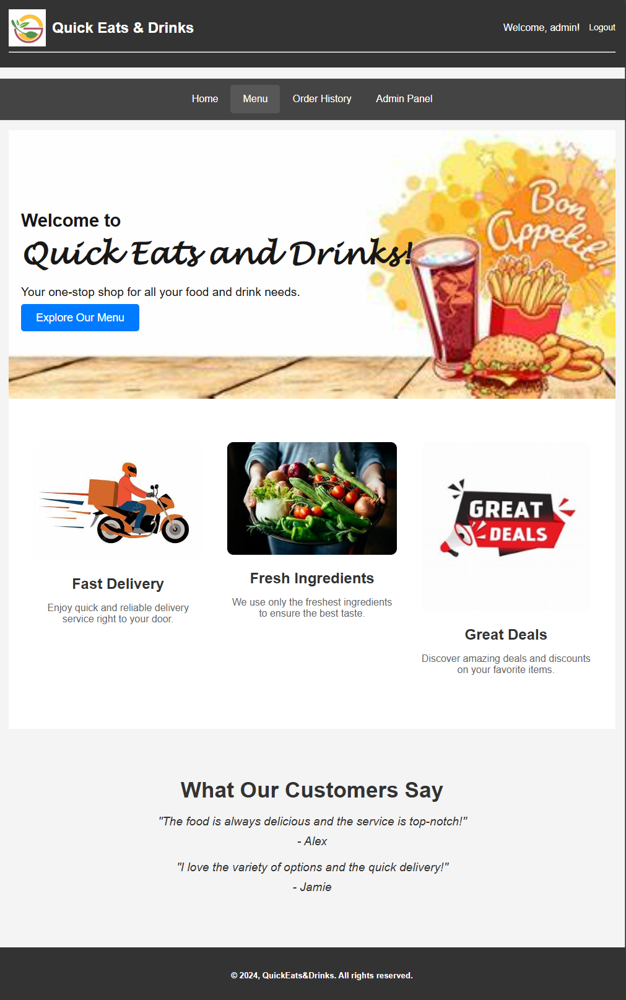

# Quick Eats & Drinks Store

**Quick Eats & Drinks Store** is an online store offering a variety of popular ready-made food products and beverages. This application caters to a broad audience seeking convenience and variety, allowing users to browse products, place orders, and manage their order history. The platform also includes an admin interface for managing products, product groups, and users.



## Table of Contents

- [Project Overview](#project-overview)
- [Features](#features)
- [Technology Stack](#technology-stack)
- [Setup and Installation](#setup-and-installation)
- [Setup Environment Configuration](#setup-environment-configuration)
- [Setup the Database](#setup-the-database)
- [Running the Application](#running-the-application)
- [Running Tests](#running-tests)
- [Folder Structure](#folder-structure)
- [Contributing](#contributing)
- [License](#license)
- [Author](#author)

## Project Overview

Quick Eats & Drinks Store provides a user-friendly interface for managing food and drink orders. Users can view products by category, place orders, and track their order history. Administrators have access to a dashboard where they can add, edit, or delete products and product groups.

## Features

- **User Authentication**: Sign up, log in, and manage user accounts.
- **Product Menu**: Browse products, view details, and add items to the cart.
- **Order Processing**: Place orders and proceed to checkout.
- **Order History**: View past orders and track order status.
- **Payment Integration**: Pay for orders with PayPal.
- **Admin Interface**: Manage products, product groups, and user accounts.
- **Responsive Design**: Optimized for both desktop and mobile devices.

## Technology Stack

- **Frontend**: HTML, CSS (stylesheets in `static/css`), JavaScript (in `static/js/menu.js`).
- **Backend**: Flask (Python framework), SQLAlchemy (ORM for database management).
- **Database**: SQLite (for development and testing), PostgreSQL (for production).
- **Payment Integration**: PayPal.
- **Testing**: pytest for integration testing.

## Folder Structure

- **app/**: Contains the core application code, including routes, models, and static assets.
  - **routes/**: Contains route handlers for different functionalities.
  - **static/**: Contains CSS, JavaScript, and image files.
  - **templates/**: Contains HTML templates for rendering views.
- **create_admin.py**: Script to create an admin user.
- **db_setup_and_seed.py**: Script to set up and seed the database.
- **instance/**: Directory for instance-specific configuration and database files.
- **migrations/**: Contains database migration files.
- **requirements.txt**: Lists the project dependencies.
- **run.py**: Entry point to run the application.
- **run_tests.py**: Script to run tests.
- **seed.py**: Script for seeding the database with initial data.
- **tests/**: Contains test files for the application.

## Setup and Installation

To set up and run the Quick Eats & Drinks Store project locally, follow these steps:

1. **Clone the Repository**:

   ```bash
   git clone https://github.com/Isaac-Ndirangu-Muturi-749/Quick-Eats-and-Drinks-Store.git
   cd Quick-Eats-and-Drinks-Store
   ```

2. **Create a Virtual Environment**:

   ```bash
   conda create --name my_env python=3.10
   conda activate my_env
   ```

3. **Install Dependencies**:

   ```bash
   pip install -r requirements.txt
   ```

## Setup Environment Configuration

1. **Create a `.env` File**

   Create a file named `.env` in the root directory of the project. This file should contain environment-specific variables, such as database configurations and secret keys. Below is a template you can use:

   ```ini
   # .env

   # Database Configuration
   DATABASE_URL=sqlite:///site.db

   # PayPal Configuration
   PAYPAL_CLIENT_ID=your_paypal_client_id
   PAYPAL_CLIENT_SECRET=your_paypal_client_secret

   # Secret Key for Flask Sessions
   SECRET_KEY=your_secret_key
   ```

   Replace `your_paypal_client_id`, `your_paypal_client_secret`, and `your_secret_key` with your actual PayPal API credentials and Flask secret key.

   The application uses the `python-dotenv` package to load environment variables from the `.env` file. Install it using:

   ```bash
   pip install python-dotenv
   ```

   In the application setup (i.e., `app/__init__.py`), load the environment variables like this:

   ```python
   from dotenv import load_dotenv
   import os

   load_dotenv()

   # Example of accessing environment variables
   PAYPAL_CLIENT_ID = os.getenv('PAYPAL_CLIENT_ID')
   PAYPAL_CLIENT_SECRET = os.getenv('PAYPAL_CLIENT_SECRET')
   SECRET_KEY = os.getenv('SECRET_KEY')
   ```

   Ensure that your PayPal payment routes and configurations use these environment variables.

## Setup the Database

Follow these steps to set up and initialize the database:

a. **Remove Existing Migrations Folder and Database File**:

   ```bash
   sudo rm -rf ./migrations/
   sudo rm -f ./instance/site.db
   ```

b. **Initialize the Migration Repository**:

   ```bash
   flask db init
   ```

c. **Generate an Initial Migration Script**:

   ```bash
   flask db migrate -m "Initial migration."
   ```

d. **Apply the Migration to the Database**:

   ```bash
   flask db upgrade
   ```

e. **Create the Admin User**:

   ```bash
   python create_admin.py
   ```

f. **Seed the Database with Initial Data**:

   ```bash
   python seed.py
   ```

   Alternatively, you can use the following command to initialize and seed the database:

   ```bash
   bash db_setup_and_seed.sh
   ```

## Running the Application

To start the application, use:

   ```bash
   python run.py
   ```

   The application will be available at [http://127.0.0.1:5000](http://127.0.0.1:5000).

## Running Tests

To run the tests for the project, use:

   ```bash
   python run_tests.py
   ```

   Alternatively, you can use:

   ```bash
   pytest
   ```

   This will execute all the tests defined in the `tests` directory and ensure everything is functioning as expected.


## Contributing

We welcome contributions to improve the project. If you'd like to contribute, please fork the repository and submit a pull request. Ensure your code adheres to the project's coding standards and includes relevant tests.

## License

This project is licensed under the MIT License - see the [LICENSE](LICENSE) file for details.

## Author

Follow me on Twitter 🐦, connect with me on LinkedIn 🔗, and check out my GitHub 🐙. You won't be disappointed!

    🐦 Twitter: https://x.com/NdiranguMuturi1
    💼 LinkedIn: https://www.linkedin.com/in/isaac-muturi-3b6b2b237
    🔗 GitHub: https://github.com/Isaac-Ndirangu-Muturi-749
    📧 Email: ndirangumuturi749@gmail.com
